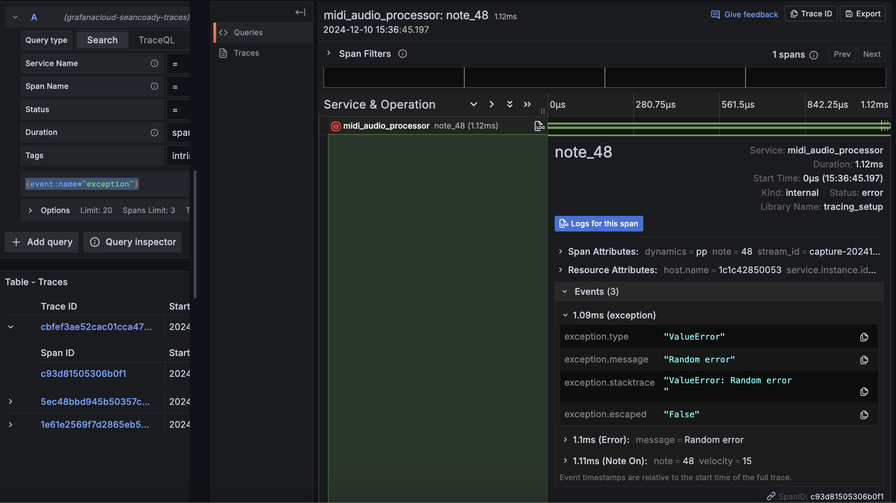

# python-midi-telemetry

## Overview

`python-midi-telemetry` is a Python library for processing and analyzing MIDI data. It provides tools to read, manipulate, and visualize MIDI files, making it easier to work with musical data programmatically.

## Features

- Read and write MIDI files
- Extract and analyze MIDI events
- Visualize MIDI data
- Support for various MIDI message types

## Basic Idea

When notes pass through a MIDI channel through a DAW, they expose several key pieces of information that the DAW will use to inform the sound processor with. Those things:

* Note number - which MIDI tone a note belongs to (e.g., note 38 is a regular snare drum hit, and note 40 is a rim shot hit, on my module)
* Velocity - the elapsed time between a note on / note off event, which is what is used to determine the dynamic value (e.g., loudness)


  

This library captures that information through two primary instrumentation implementations:

*Tracing*: 
* Each trace begins with a root span from a "Note On" event
* * Note On events capture the timeInMillis when the note was captured, the note number, and the MIDI channel that is streaming the note
* Each trace ends with a span from a "Note Off" event
* * Note Off events will capture the timeInMillis (which is in turn used to create the "Velocity" figure), note number, and MIDI channel as well.

If I were to encounter errors in my MIDI capturing, I'd then be able to easily search for span events that identify the errors quickly.

<video controls src="midirecording.mp4" title="Title"></video>





*Metrics* :
* When spans are sent through the opentelemetry collector, metrics are generated via the `spanmetrics` connector. Since I would like to have a more granular view in to these metrics (i.e., count by note number, count by dynamic value, etc), I need to write a `spanmetrics` configuration that creates the relevant dimensions for me.

```yaml
connectors:
  spanmetrics:
    histogram:
      explicit:
        buckets: [100us, 500us, 1ms, 5ms, 10ms, 50ms, 100ms, 500ms, 1s] # Adjusted for real-time MIDI response
    dimensions:
      - name: note # Dimension for analyzing latency by MIDI note
      - name: velocity_on # Optional: Include velocity of "note_on" for additional granularity
      - name: velocity_off # Optional: Include velocity of "note_off"
      - name: elapsed_time
      - name: service_name
      - name: dynamics
      - name: stream_id
    exemplars:
      enabled: true
```

This gives me the ability to create queries that show, for example, distributions of values. Maybe I want to see the percentage of notes that were recorded as "ff" (fortissimo), or show the 99th percentile of elapsed time (latency between note on / note off) 


*Logs*:
* Logs are additionally being used here just to showcase that you could send all three telemetry types, but mostly I am relying on tracing data, and in turn, metrics derived from tracing data. 


## Contributing

Contributions are welcome! Please fork the repository and submit a pull request.

## License

This project is licensed under the MIT License.